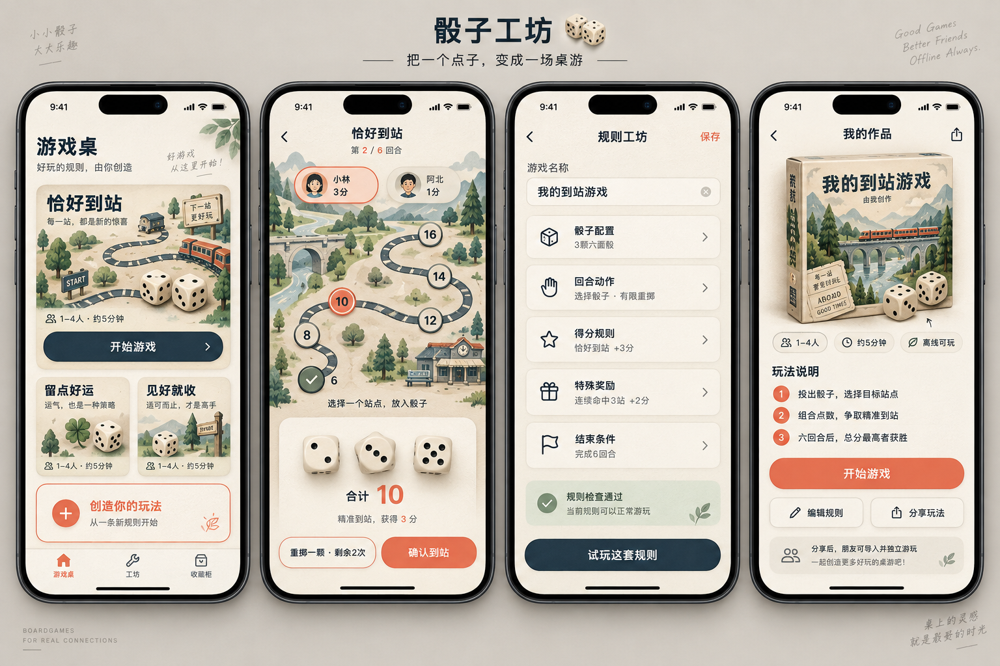

# 骰子工坊 · 原型说明

## 1. 原型图



[打开原始 PNG](assets/prototype-v1.png)

生成方式：内置 image_gen。原型为视觉探索，不是交互原型，也不是可直接切图实现的完整 UI 规格。

## 2. 从左到右的页面

| 页面 | 主要内容 | 操作流向 |
| --- | --- | --- |
| 游戏桌 | 内置玩法卡片、人数时长、开始游戏、创作入口、底部导航 | 游戏详情或玩家设置；工坊新建 |
| 对局页 | 当前玩家、轮次、路线站点、骰子、合计、计分提示、重掷和确认 | 确认后推进下一玩家；最后一轮进入结算 |
| 规则工坊 | 名称、骰子配置、动作、得分、奖励、结束条件、校验结果 | 编辑参数、保存、试玩 |
| 作品详情 | 作品封面、人数时长、玩法说明、开始、编辑、分享 | 玩家设置、规则工坊、系统分享面板 |

正式开发中，“游戏桌”与“作品详情”的开始按钮统一进入简短玩家设置；继续上局直接恢复对局。试玩使用临时规则快照，不覆盖正式存档。

## 3. 视觉规范建议

- 奶油白 `#F7F3E9`：页面和纸张底色。
- 墨蓝 `#20354A`：主文字、路线、部分主操作。
- 珊瑚橙 `#ED785E`：选中站点、关键操作和强调。
- 低饱和鼠尾草绿：成功和检查通过状态，搭配文字和图标表达。
- 采用系统中文字体、清晰字号层级和圆角卡片；主要按钮建议至少 44pt 可点击区域。
- 插画作为氛围层，操作区保持对比度。骰子点数、规则和按钮文案使用真实绘制或控件。

## 4. 素材拆分

| 类型 | 实现方式 |
| --- | --- |
| 山水、车站、游戏封面 | 单独制作位图插画，加入 Asset Catalog |
| 纸张纹理 | 低对比度可复用纹理，避免影响文字 |
| 路线、站点、选中和完成状态 | UIView / CAShapeLayer 动态绘制 |
| 骰子 | 程序绘制准确点数，动画控制翻转、缩放和阴影 |
| 按钮、文字、分数、规则卡 | UIKit 真实控件 |

## 5. 实现时需修正或补齐

- 概念图中每颗骰子的透视点数不能作为业务依据，实际点数由引擎唯一决定。
- 站点必须具备足够点击范围，地图插画随布局裁切，站点坐标由布局计算。
- “精准到站，获得 3 分”在确认前应显示为“预计获得 3 分”，确认后才写入成绩。
- 图中重掷剩余次数需明确为“本局剩余”，连击按行动顺序计算，避免与地图相邻站点混淆。
- 规则检查通过仅表示符合当前模板的校验，不代表游戏已经证明平衡或好玩。
- 导航中的收藏柜列表、工坊作品列表、玩家设置、结算、参数编辑、空状态、导入失败、存档恢复及设置页尚未绘制。
- 适配大字体、VoiceOver 和减少动态效果；颜色之外用文本或形状区分状态。

## 6. 原型生成提示词记录

以下为生成时的完整提示词，供后续视觉迭代复用。提示词中的部分概念表达已由产品方案进一步明确，实现以产品方案和技术方案为准。

```text
Use case: ui-mockup
Create a polished high-fidelity Chinese iOS app prototype presentation for “骰子工坊”, an OFFLINE dice boardgame creation app supporting 1–4 people sharing one phone. One wide landscape image with FOUR complete front-facing iPhone screen designs side by side, equal scale, readable and detailed, no perspective. A quiet warm gray background, small elegant presentation title “骰子工坊” and subtitle “把一个点子，变成一场桌游”. Each screen should be tall, modern, editorial and realistically implementable. Cream paper #F7F3E9, ink navy #20354A, coral orange #ED785E, small muted sage accents. Sophisticated tactile paper boardgame aesthetic with crisp Chinese sans-serif typography, ample spacing, rounded cards, subtle paper grain and shadows, restrained beautifully rendered ivory dice. No casino imagery, no online rooms, no chat, no AI buttons.
Screen 1 游戏桌: iOS status bar 9:41. Top title “游戏桌”, small text “好玩的规则，由你创造”. Large illustrated original game card titled “恰好到站”, with a miniature winding transit route board, ivory dice, “1–4人 · 约5分钟” and navy action “开始游戏”. Below two smaller game cards “留点好运” and “见好就收”. A coral outlined card “创造你的玩法” with text “从一条新规则开始”. Bottom navigation 游戏桌 / 工坊 / 收藏柜, first active.
Screen 2 active offline game “恰好到站”: back icon, title, small “第 2 / 6 回合”. Two compact player score pills “小林 3分” and “阿北 1分”, 小林 active. Central cream paper route board with SIX circular stations connected along elegant winding navy track, target labels 6,8,10,12,14,16, 6 already complete with checkmark, station 10 coral selected. Small “选择一个站点，放入骰子”. Lower inset tray with three ivory dice showing 2,3,5, a clear total “合计 10”. Score explanation small “精准到站，获得 3 分”. Buttons “重掷一颗 · 剩余2次” secondary and “确认到站” primary coral. No tab bar in game.
Screen 3 rule editor: back, title “规则工坊”, top right “保存”. Game name editable field “我的到站游戏”. Five elegant stacked modular cards each with tiny line icon and chevron: “骰子配置” value “3颗六面骰”; “回合动作” value “选择骰子 · 有限重掷”; “得分规则” value “恰好到站 +3分”; “特殊奖励” value “连续命中3站 +2分”; “结束条件” value “完成6回合”. Small sage validation box “规则检查通过”. Bottom anchored navy button “试玩这套规则”.
Screen 4 saved game detail: back, title “我的作品”, share icon. Large box-cover illustration in paper print style of a transit map and dice, title “我的到站游戏”, discreet “由我创作”. Chips “1–4人” “约5分钟” “离线可玩”. Section “玩法说明” with three concise numbered lines “投出骰子，选择目标站点” / “组合点数，争取精准到站” / “六回合后，总分最高者获胜”. Primary coral button “开始游戏”, secondary buttons “编辑规则” and “分享玩法”. Bottom note “分享后，朋友可导入并独立游玩”. No online multiplayer.
Render all Chinese labels accurately, keep all screens fully in frame with bottom home indicators, consistent iOS spacing, legible hierarchy, premium original product design rather than generic dashboard.
```
