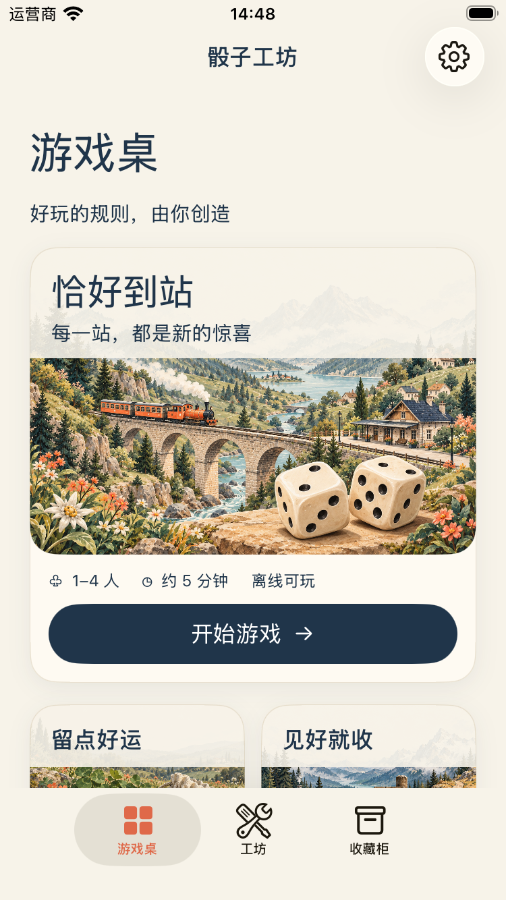
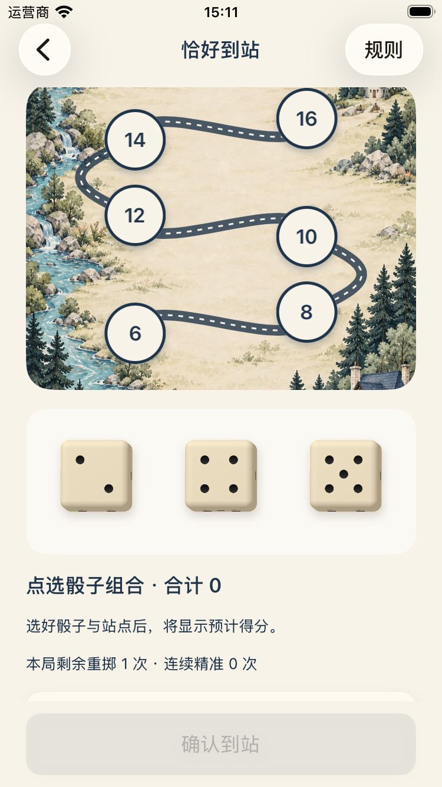

# 插图与结果骰子对齐原型

参考 `assets/prototype-v1.png`。结果骰子由系统 SceneKit 渲染圆角象牙色实体，六面点数由代码生成，相对面之和为 7；正面对应游戏实际结果，结果正面统一朝向，取消平面内倾斜，只保留约 3° 的轻微侧向视角。图像按点数缓存，点选使用原有 UIButton 与游戏动作；阴影、珊瑚色选中边框和辅助功能描述保留。

## 插图

使用内置 imagegen 工具编辑现有插图，原型仅作风格与布局参考。素材已复制进工程资源目录：

- [StationArt](../../Dundaillereal/Assets.xcassets/StationArt.imageset/StationArt.png)：保留火车与石桥，前景加入两颗明显的象牙骰子。
- [RiskArt](../../Dundaillereal/Assets.xcassets/RiskArt.imageset/RiskArt.png)：保留岔路、路牌和群山，将前景背包替换为骰子。
- [BoardArt](../../Dundaillereal/Assets.xcassets/BoardArt.imageset/BoardArt.png)：左下角加入装饰骰子，中央路线区域保持留白。
- LuckyArt 原本已有骰子，沿用现有画面。

插图中的骰子仅作装饰，不承担动态结果或命中区域。

## 最终提示词

### StationArt

Edit first image (StationArt) for an iOS board game cover. Second image is style/composition reference only. Preserve original warm watercolor gouache paper texture, Alpine orange train and stone viaduct, mountains. Add TWO prominent ivory rounded six-sided dice with inset black pips in foreground lower right/center, like the tabletop dice in reference game's first cover. Dice should occupy about 25% image width together and sit convincingly on a little warm parchment tabletop ledge amongst foliage, correct perspective and soft contact shadows. Make composition feel like inviting illustrated tabletop board game rather than just travel scenery. Retain upper 30% quiet for native heading. Landscape 1536x1024. No text, no UI, no logos. Preserve train visibility. Return edited artwork.

### RiskArt

Use case precise-object-edit. Edit image 1, image 2 is style reference only. For iOS dice board game illustrated cover, preserve alpine trail crossroads, rustic signpost, mountains, warm watercolor gouache paper palette. Replace foreground orange backpack with TWO large warm ivory rounded dice with clean inset black circular pips on their visible faces. Dice sit on trail ledge beside signpost, natural soft contact shadows, one slightly rotated, distinct six-sided cubes. Dice must be clearly readable at small card size, together 30 percent image width. Keep upper 30 percent calm for native title overlay, preserve all other scenic atmosphere. Square image. No words, no logos, no UI.

### BoardArt

Edit target first image only; second image is board-game style reference. Preserve the tall Alpine watercolor map backdrop with empty cream central space, train station bottom right and river on left. Add a small pair of warm ivory rounded dice with recessed dark pips nestled on a parchment-colored rocky ledge at the lower LEFT next to the river, together no more than 18 percent image width. They are decorative board-game motifs, not interactive result dice. Keep the entire central 65 percent of image clear for native route and station overlays. Maintain exact portrait composition, paper texture, sage forest colors and orange train. No text, no UI, no extra paths or printed numbers. Output portrait 1024x1536.

## 实际页面

## 验证

- iPhone SE 第 3 代 / iOS 26.5：Debug 构建与现有 3 条 UI 流程通过，覆盖试玩、正式对局恢复/结算、单颗重掷。
- 首次回归发现 UI 测试会在投骰结果按钮出现前访问元素类型；测试操作助手增加等待元素出现，重新回归通过。
- 最终材质调整另外运行单颗重掷检查，核对结果截图、点数与保留骰子一致。使用系统 SceneKit，无第三方依赖；未修改 Bundle ID、签名和发布配置。

## 正面朝向调整

按最新反馈取消结果骰子的错落旋转，统一为近乎正视的姿态（平面旋转为零），通过窄侧面、圆角倒角和短柔投影保留厚度感。缓存由点数与姿态改为仅按点数。投掷动画与音效保持原有行为。Debug 构建及单颗重掷 UI 检查通过（1 test，0 failures），已检查上方实际截图。
