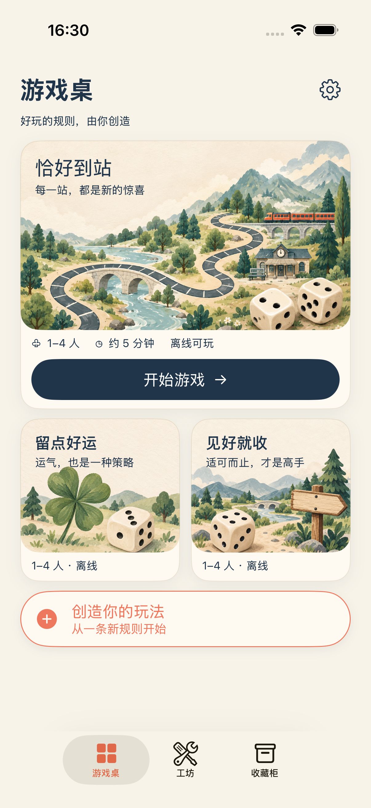
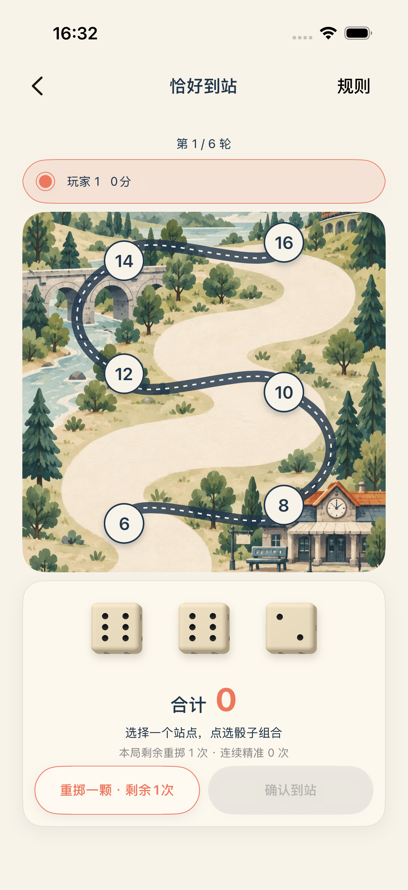
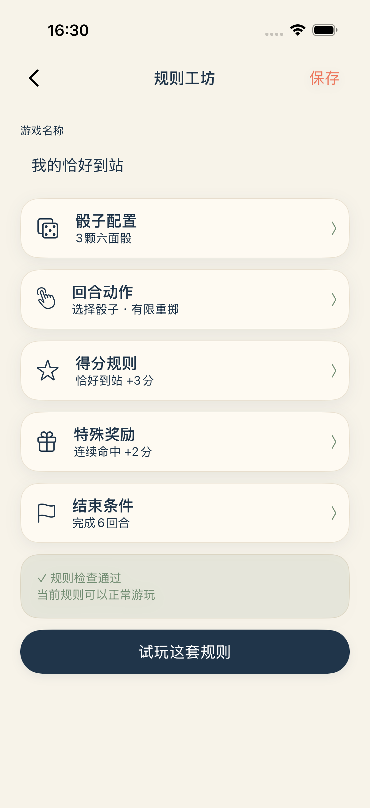
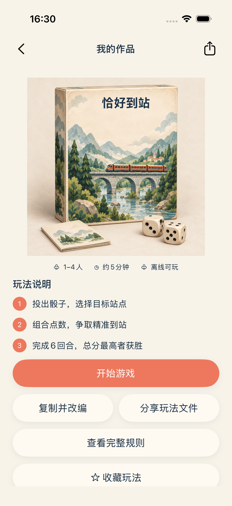

# 按四屏原型重排 · 2026-09-21

以 `assets/prototype-v1.png` 四屏为布局基准，重排 UIKit 页面，并为确定好的区域生成配套插图。

## 页面变化

- 首页：移除重复导航标题，紧凑标题区 + 一张主玩法卡 + 两张小玩法卡 + 创作入口；标题直接排在插图留白区域。小卡整张可点。
- 对局：轮次、玩家、地图和骰盘连贯排列；骰盘包含正面骰子、珊瑚色合计、预计得分、剩余额度及并排重掷/确认按钮。地图高度按可用屏幕高度调整。辅助功能大字号仍使用可滚动站点列表。
- 规则工坊：名称输入 + 五个可展开规则组 + 校验状态 + 试玩按钮。所有原有参数仍可编辑，保存移至右上角。
- 详情：实体游戏盒封面、三步玩法说明、开始游戏，以及编辑/分享操作。完整动态规则、收藏、规则图片分享和删除入口保留。
- 二级页面隐藏底部标签栏；iOS 26 的导航按钮去掉共享玻璃底。首页保留系统标签栏。

游戏引擎、存档结构、骰子音效和投掷动画未更改。正面结果骰子沿用最新确认的统一朝向方案。没有调整 Bundle ID、签名或发布配置，没有新增第三方库。

## 插图与保存位置

通过内置 imagegen（非 CLI）生成以下五张配套插图；原型仅用于画风和构图参考，不把原型截图当作界面背景。生成结果已保存到工程：

- [StationArt](../../Dundaillereal/Assets.xcassets/StationArt.imageset/StationArt.png)
- [BoardArt](../../Dundaillereal/Assets.xcassets/BoardArt.imageset/BoardArt.png)
- [LuckyArt](../../Dundaillereal/Assets.xcassets/LuckyArt.imageset/LuckyArt.png)
- [RiskArt](../../Dundaillereal/Assets.xcassets/RiskArt.imageset/RiskArt.png)
- [GameBoxArt](../../Dundaillereal/Assets.xcassets/GameBoxArt.imageset/GameBoxArt.png)

装饰插图不包含实时点数、文字、路线命中区域或计分。标题、站点、按钮和骰子结果全部为原生控件。小屏及大字号允许滚动，不强行缩小可读文字。

## 最终提示词

### StationArt
Create one standalone illustrated cover artwork for the FIRST phone's main game card in this reference. Match its simplified charming hand-painted tabletop board game art exactly in spirit: warm cream parchment, flat gouache shapes, muted sage trees, winding charcoal game track, a tiny station and orange toy train, TWO ivory dice in lower right with inset black pips. NOT a photorealistic Alpine travel landscape. Landscape 1536x1024. Design upper left 40 percent with quiet cream space for native Chinese title overlay. Main story in lower two thirds, dice around 20 percent width. No text, numbers, labels, buttons, phone frame, or UI. Artwork only, full bleed.

### BoardArt
Generate ONLY a tall map backdrop illustration inspired by the second phone's game board. Flat storybook gouache, warm cream paper, simple sage-green miniature trees, gentle hills and misty mountains, small stone bridge along left, small orange-roof train station lower right. Keep wide winding empty cream corridor from lower left to upper right for native game track overlay. Do NOT draw track, route, circles, numbers or any UI; do not draw dice. Portrait 1024x1536. Reduce realistic detail: simple layered painted silhouettes, clear open center, warm board game illustration like supplied prototype, NOT panoramic photography.

### GameBoxArt
Generate one standalone portrait illustration of a physical tabletop board game box, like the FOURTH phone reference. Box standing upright viewed front with narrow left spine, warm ivory parchment cardboard and rounded worn edges, cover illustration simplified sage mountains, stone bridge and orange toy train. Two small rounded ivory dice in foreground lower right and a small blank rulebook lower left. Upper 25 percent of front cover stays blank cream for native title overlay. Warm cream paper background, soft studio contact shadows, tasteful gouache illustrated surface, all within centered composition. No text, letters, numbers, logos, UI or phone frames. 1024x1024 square canvas, entire box visible, fill most of frame.

### LuckyArt
Standalone square artwork for the FIRST phone's lower-left 'lucky' mini card. Match reference flat hand painted tabletop gouache style. A large sage green four-leaf clover on the left and one small rounded ivory dice with black inset pips on the right, a few miniature trees and gentle hills behind, warm cream textured paper. Top 35 percent mostly empty warm paper for native heading. Simple, charming, few elements, not photorealistic, no text, no UI, no phone, no border. 1024x1024.

### RiskArt
Standalone square artwork for FIRST phone's lower-right adventure mini card. Same simplified flat gouache board-game illustration as reference: one rounded ivory dice with black inset pips in lower left, small rustic wooden signpost right with BLANK sign, a sage pine tree and layered blue gray hills behind. Warm cream paper, upper 35 percent mostly empty for native heading. Charming toy scale, simple painted shapes, not photo landscape. No text or UI or borders. 1024x1024.

## 实际运行截图

以下为 iPhone 17 Pro 模拟器截图，非设计稿。

| 游戏桌 | 对局 | 规则工坊 | 我的作品 |
| --- | --- | --- | --- |
|  |  |  |  |

SE 小屏保留纵向滚动以保证按钮和文字可用：[首页](assets/prototype-v4/se-home.png)、[对局](assets/prototype-v4/se-game.png)、[工坊](assets/prototype-v4/se-editor.png)、[详情](assets/prototype-v4/se-detail.png)。

截图中的对局尚未选择骰子，因此合计为 0；选择后才显示所选组合的点数。工坊截图拍摄后补充了规则组摘要随参数编辑更新，已另行验证。

## 验证

- Debug 构建成功。
- iPhone 17 Pro 与 iPhone SE 第 3 代各通过 3 项 UI 测试：编辑/试玩/保存、正式对局恢复与结束、单颗重掷，共 6 项通过、0 失败。
- 最后补充规则摘要动态更新后，iPhone 17 Pro 的编辑/试玩/保存专项再次通过。
- 已逐屏检查上述两种尺寸截图；小屏部分操作需滚动。
- 本轮未改动规则引擎、动画和音频实现；未做真机验证。

## 路线与结算节点修正

节点从 40 点增至 52 点，站点数字与得分使用两级粗体居中排版；已填写节点保留深色文字和绿色底色，不再由禁用状态自动变淡。路线使用底图坐标描绘，并与插图共用 aspect-fill 缩放及裁切偏移，节点沿可见道路按距离分布。

Debug 构建成功；iPhone 17 Pro 和 SE 第 3 代各通过一次完整对局恢复/结束测试，含已填写节点状态检查。初次新增测试把随机得分假设为 0 导致断言失败，已改为检查已填写状态；最终两台均通过。

[普通屏幕实际截图](assets/prototype-v4/aligned-scored-route.png) · [SE 实际截图](assets/prototype-v4/aligned-scored-route-se.png)
