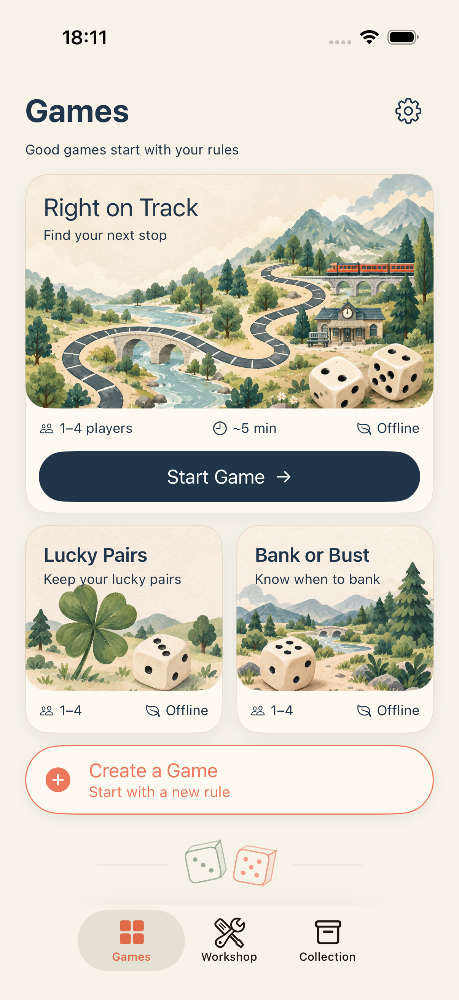
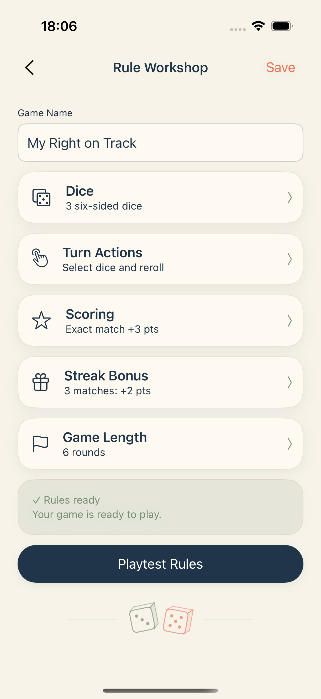
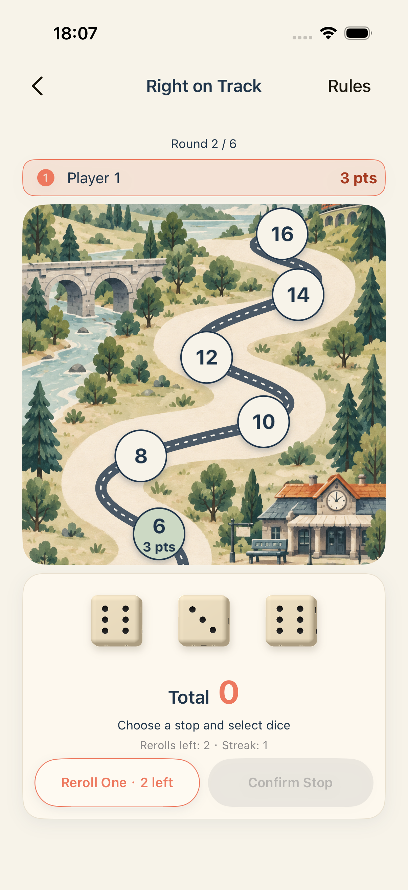

# English interface

The application now presents its own interface, game rules, errors, accessibility labels, sharing text, default names, and settings in English. The display name is **Dice Workshop**. The bundle identifier, signing, data schema, and rules are unchanged.

Built-in games: **Right on Track**, **Lucky Pairs**, **Bank or Bust**. Supported app localization is English; history dates use an English locale. The source, tests, scripts, plist, and storyboard scan found no Han characters. Full-width comma input remains supported through a Unicode escape.

Updated migration policy: saved names containing Han characters are replaced with English labels at load time. Built-in game names use their English titles; custom games use their template title plus a stable ID suffix; players use Player 1, Player 2, etc. Scores, rules, IDs, favorites, and progress are preserved. Original data is backed up before migration. Imported names and historical scoring reasons are normalized as well. Name fields accept printable ASCII to prevent new Chinese labels. System-owned content such as carrier names is controlled by iOS. Earlier product discussions and prototype documents remain in their original language; this implementation record is English.

## Validation

- 48 core checks passed.
- All four UI flows passed on both iPhone 17 Pro and iPhone SE (3rd generation): eight tests, zero failures.
- Release archive succeeded with signing disabled; no upload was performed.
- Reviewed actual English home, editor, and scored-route screenshots at both screen sizes. Compact-card player counts were subsequently shortened to avoid wrapping, with the full player-count accessibility label retained.

## Screenshots

| Games | Rule Workshop | Scored stops |
| --- | --- | --- |
|  |  |  |

Small screens retain scrolling: [SE home](assets/english/se-visual-home.png), [SE editor](assets/english/se-visual-editor.png), [SE stops](assets/english/se-scored-route-node.png).

After the compact-card adjustment, the two-template UI flow and final unsigned Release archive both passed again. The regular home screenshot reflects this final adjustment.

## Legacy-data follow-up

The initial interface translation did not cover saved names. This is now corrected by a persisted, idempotent migration at the storage boundary, also applied to imports and commits. The pre-migration file is retained with the `.before-english` extension.

61 core checks passed, including legacy custom games, built-in names, players, historical receipts, score/ID/progress preservation, backup fidelity, persistence, idempotence, and import handling. Final unsigned Release archive succeeded.

The edit/playtest/save and full-game resume/finish UI flows also passed after migration (2 tests, zero failures).
